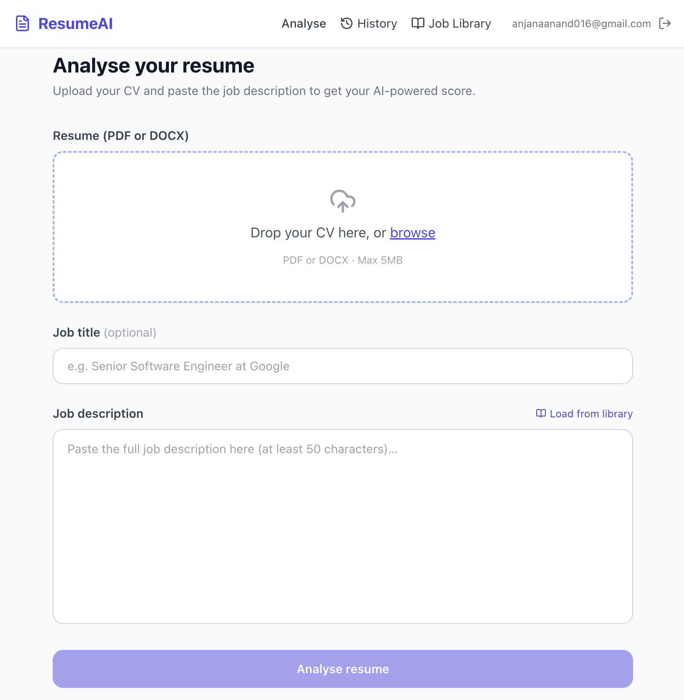
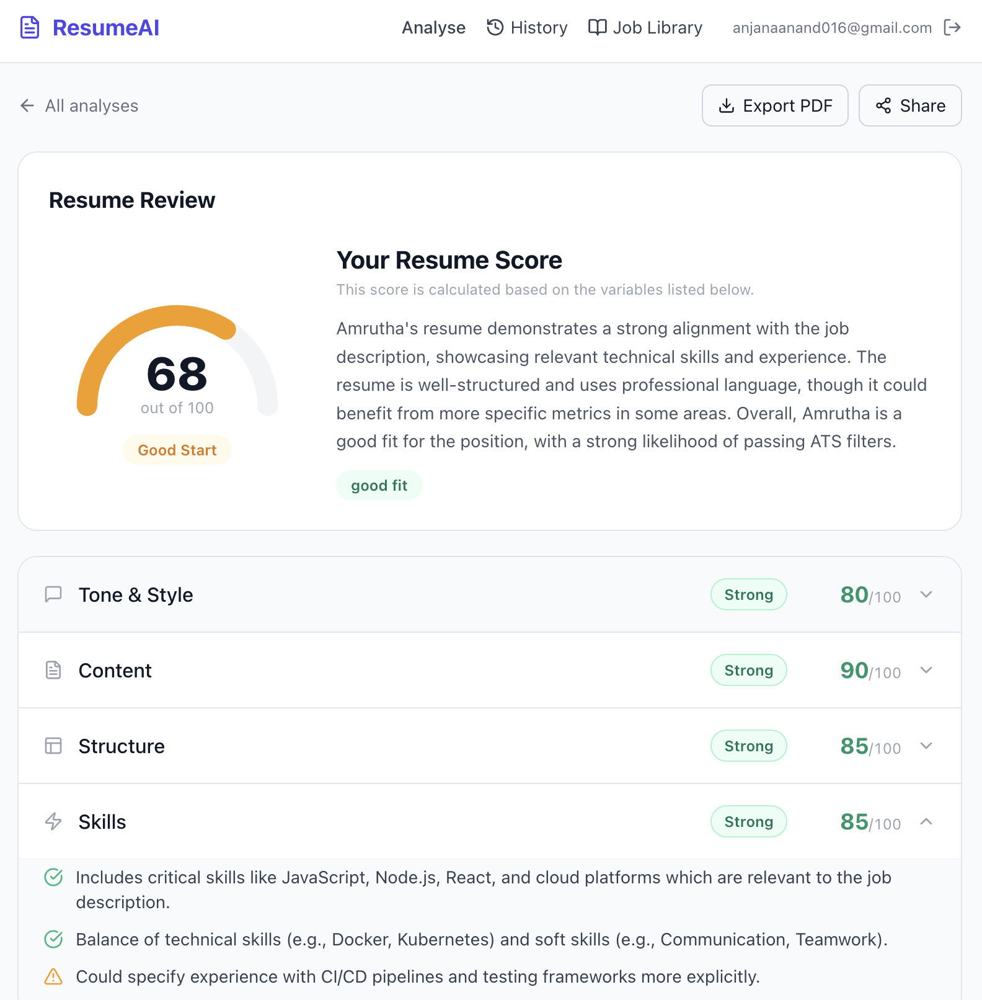
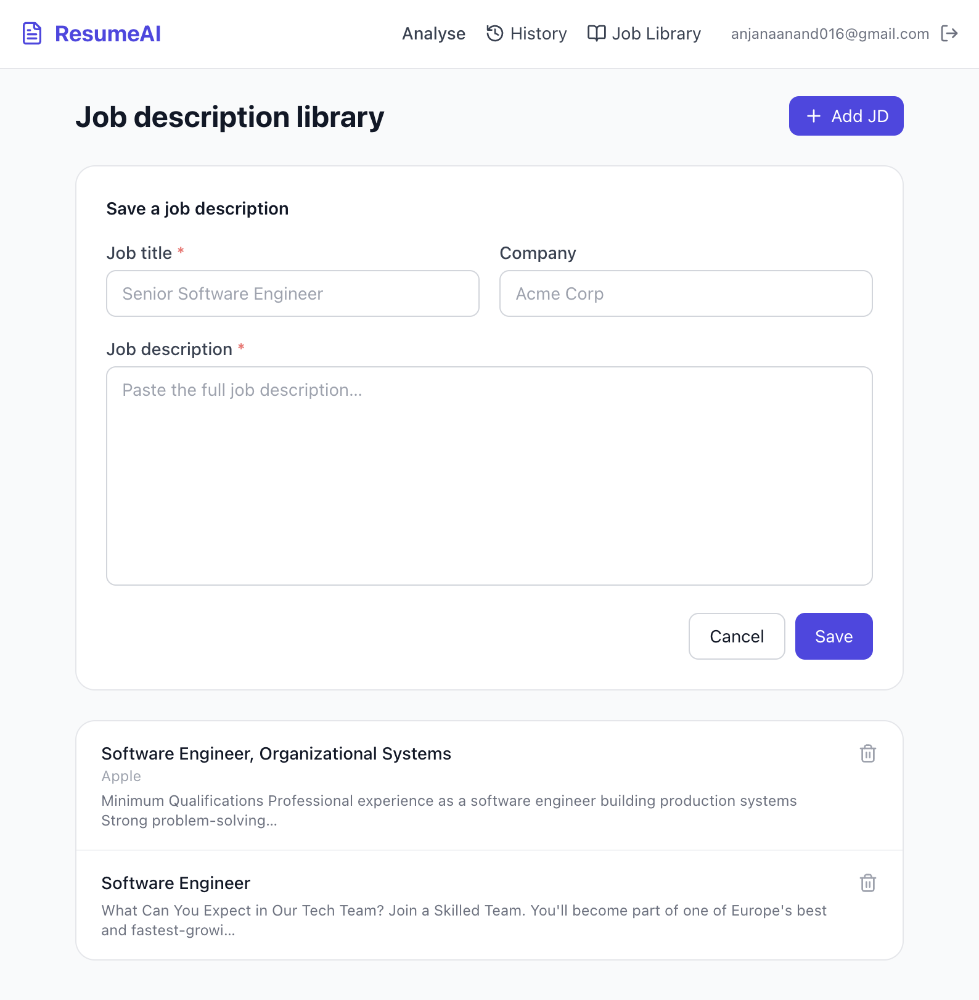
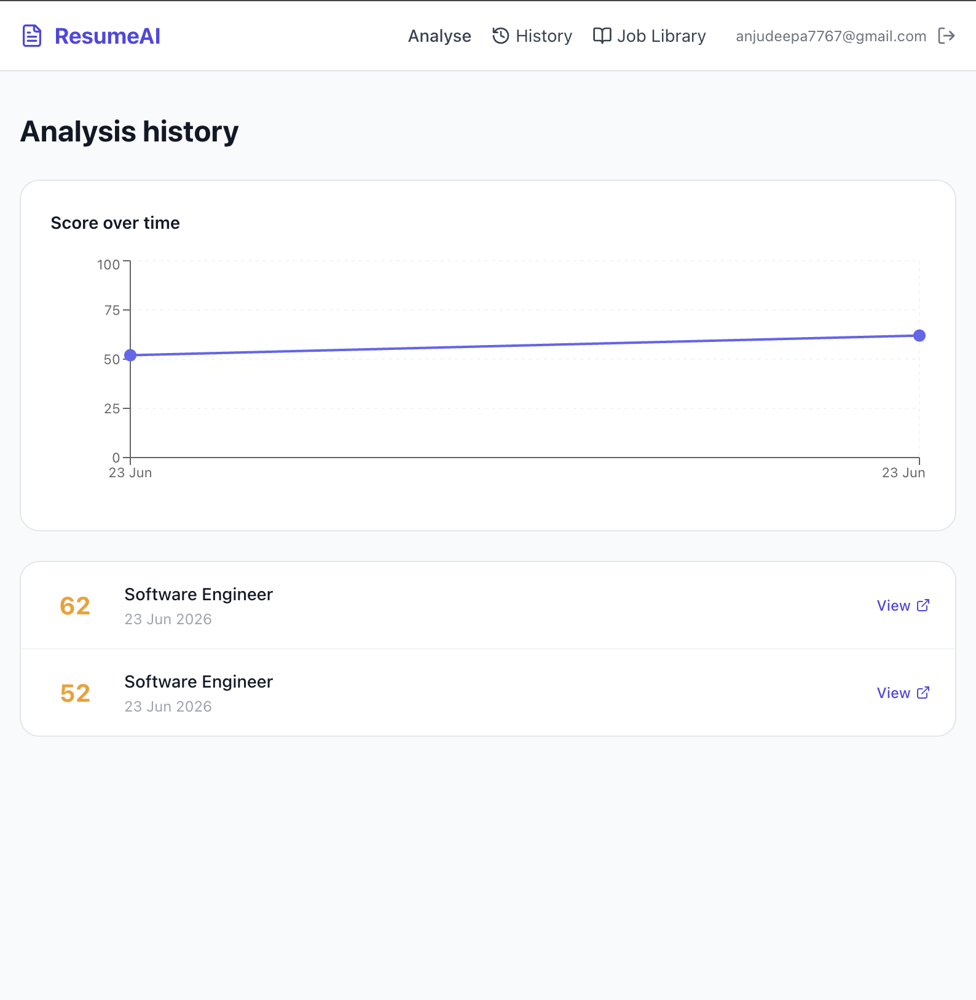

# ResumeAI — AI-Powered Resume Analyser

> Live at **[https://ai-cv-analyser-seven.vercel.app](https://ai-cv-analyser-seven.vercel.app)**

An AI-powered web application that analyses resumes against job descriptions and provides a detailed score, ATS compatibility check, keyword gap analysis, and rewrite suggestions — powered by GPT-4o.

---

## Features

- AI scoring across tone, content, structure, and skills
- ATS compatibility check
- Keyword gap analysis
- Rewrite suggestions
- PDF export
- Shareable results link
- Google OAuth + email/password sign in
- Job description library
- Analysis history

---

## Tech Stack

**Client** — React 18, TypeScript, Vite, Tailwind CSS, Zustand

**Server** — Node.js, Express, TypeScript, Prisma, PostgreSQL, Bull, Redis, OpenAI GPT-4o, Passport.js

**Infrastructure** — Vercel (client) · Render (server + DB) · Upstash (Redis)

---

## Project Structure

```
AI_CV_Analyser/
└── ai-resume-analyser/
    ├── client/                         # React + Vite frontend
    │   ├── src/
    │   │   ├── components/
    │   │   │   ├── analysis/           # ScoreGauge, ATSCard, SectionAccordion,
    │   │   │   │                       # KeywordGap, SuggestionCard
    │   │   │   └── layout/             # Navbar, PageShell
    │   │   ├── hooks/                  # useAuth, useAnalysis, useSSE
    │   │   ├── pages/                  # Login, Register, Analyse, Results,
    │   │   │                           # History, JobLibrary, SharedResult,
    │   │   │                           # AuthCallback
    │   │   ├── services/               # api.ts, auth.service.ts,
    │   │   │                           # analysis.service.ts
    │   │   └── types/                  # TypeScript interfaces
    │   └── vercel.json                 # API proxy + SPA catch-all rewrites
    │
    └── server/                         # Express + Node.js backend
        ├── prisma/
        │   ├── schema.prisma           # User, Analysis, RefreshToken, SavedJD
        │   └── migrations/
        ├── src/
        │   ├── lib/                    # prisma, redis, openai, cloudinary,
        │   │                           # passport
        │   ├── middleware/             # auth, rateLimiter, validate, error
        │   ├── routes/                 # auth.routes, analysis.routes, jd.routes
        │   ├── services/               # auth, analysis (GPT-4o), export (PDF),
        │   │                           # resumeParser
        │   ├── workers/                # Bull queue processor
        │   └── types/
        ├── Dockerfile
        └── render.yaml
```

---
## Screenshots

<p>
  
   
  
</p>
<p>
  

  
</p>

---

## Render Environment Variables

Set these in Render → your web service → **Environment**:

| Variable | Value |
|---|---|
| `DATABASE_URL` | Render internal PostgreSQL URL |
| `JWT_ACCESS_SECRET` | Random string, min 32 chars |
| `JWT_REFRESH_SECRET` | Random string, min 32 chars |
| `REDIS_HOST` | Upstash hostname |
| `REDIS_PORT` | `6379` |
| `REDIS_PASSWORD` | Upstash password |
| `REDIS_TLS` | `true` |
| `OPENAI_API_KEY` | OpenAI API key |
| `GOOGLE_CLIENT_ID` | Google OAuth client ID |
| `GOOGLE_CLIENT_SECRET` | Google OAuth client secret |
| `GOOGLE_CALLBACK_URL` | `https://resume-analyser-server-pb2q.onrender.com/api/auth/google/callback` |
| `CLIENT_URL` | `https://ai-cv-analyser-seven.vercel.app` |
| `NODE_ENV` | `production` |
| `CLOUDINARY_CLOUD_NAME` | Cloudinary cloud name |
| `CLOUDINARY_API_KEY` | Cloudinary API key |
| `CLOUDINARY_API_SECRET` | Cloudinary API secret |

---

## Render Build & Start

| | Command |
|---|---|
| **Build** | `npm install --include=dev && npx prisma generate && npx prisma migrate deploy && npm run build` |
| **Start** | `npm start` |
| **Root directory** | `ai-resume-analyser/server` |

---

## Google Cloud Console

| Setting | Value |
|---|---|
| Authorised JavaScript origins | `https://ai-cv-analyser-seven.vercel.app` |
| Authorised redirect URI | `https://resume-analyser-server-pb2q.onrender.com/api/auth/google/callback` |
| OAuth consent screen status | Published |

---

## Vercel Settings

| Setting | Value |
|---|---|
| Root directory | `ai-resume-analyser/client` |
| Framework | Vite |
| Build command | `npm run build` |
| Output directory | `dist` |

`client/vercel.json` proxies all `/api/*` requests to the Render server and includes a catch-all rewrite so React Router handles all page routes.

---

## License

MIT
